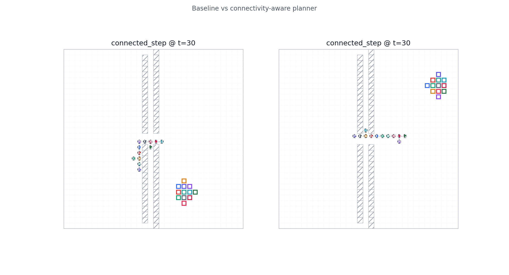
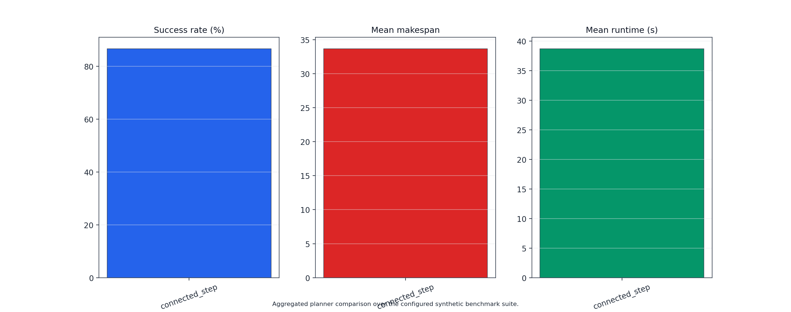
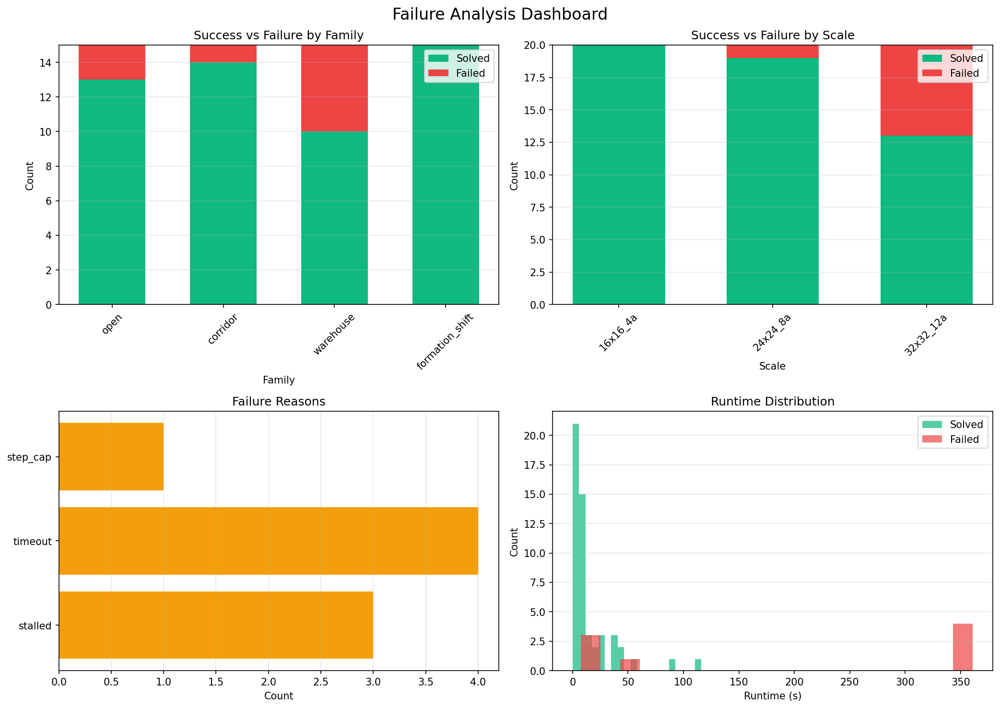

# CC-MAPF: Connectivity-Constrained Multi-Agent Path Finding

[](https://www.python.org/downloads/)
[](https://opensource.org/licenses/MIT)

A research-grade Python toolkit for **connectivity-constrained multi-agent path finding** on 2D grids.

## 📊 Results

**86.7% Success Rate** (52/60 instances)

| Family | Success Rate |
|--------|-------------|
| Formation Shift | 100% |
| Corridor | 93.3% |
| Open Space | 86.7% |
| Warehouse | 66.7% |

## 🎨 Visualizations

### Problem Setup

*Initial configuration: agents (circles), goals (squares), obstacles (hatched)*

### Start Configuration

*Connected team at timestep 0*

### Corridor Execution

*Mid-execution in corridor environment*

### Formation Transition

*Dynamic formation shift maneuver*

### Final Configuration

*All goals reached*

### Baseline Comparison

*Baseline (left) vs Connected step (right)*

### Benchmark Summary

*Performance metrics*

## 🗺️ Traffic Heatmaps

### Open Space


### Corridor


### Warehouse


### Formation Shift


## 📈 Failure Analysis


*Success/failure breakdown by family, scale, and runtime*

## 🚀 Quick Start

```bash
# Install
python3 -m pip install -e .[dev]

# Run benchmark
ccmapf batch --config configs/suites/overnight_premium.yaml

# Generate visualizations
python render_advanced_visualizations.py artifacts/runs/{run_id} visualisasi
```

## 📁 Project Structure

```
cc-mapf/
├── configs/          # Configurations
├── src/cc_mapf/      # Source code
├── docs/assets/      # Visualization images
└── README.md
```

## 📝 Citation

```bibtex
@software{cc_mapf,
  title={CC-MAPF: Connectivity-Constrained Multi-Agent Path Finding},
  author={Research Team},
  year={2026},
  url={https://github.com/aimldlnlp/cc-mapf}
}
```

## 📄 License

MIT License
