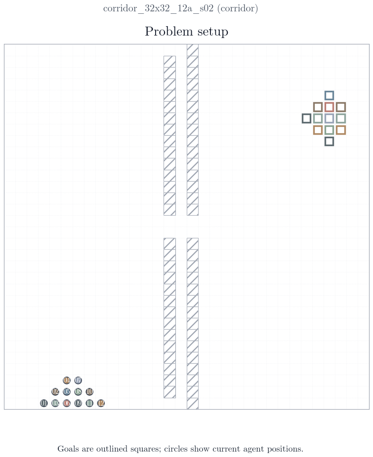
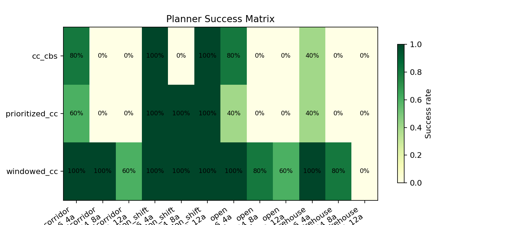
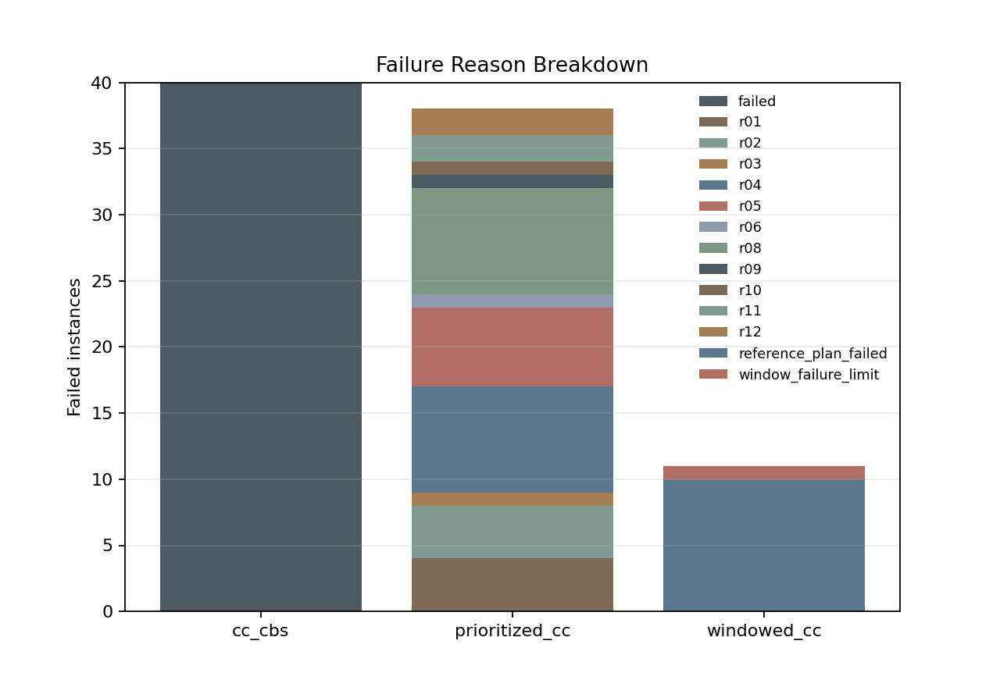
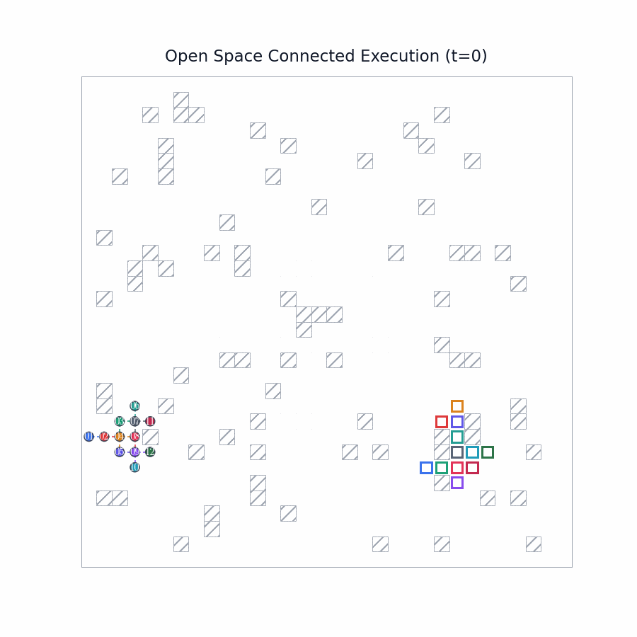
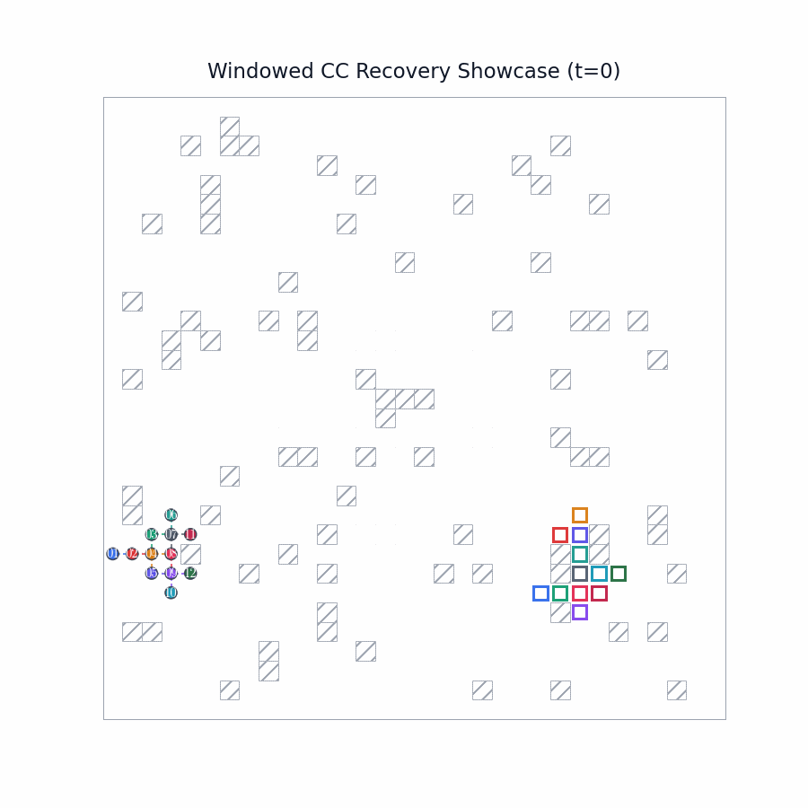

# CC-MAPF

Connectivity-Constrained Multi-Agent Path Finding research codebase with benchmark automation, paper-style rendering, and detached experiment runners.



## Current Status

The repository is currently centered on the 4/6/8/10-agent paper suite using `connected_step` as the best-performing planner on the official benchmark.

Official best run summary:

| Slice | Solved / Total | Success Rate |
| --- | ---: | ---: |
| Overall | 47 / 48 | 97.9% |
| 16x16_4a | 12 / 12 | 100.0% |
| 20x20_6a | 12 / 12 | 100.0% |
| 24x24_8a | 11 / 12 | 91.7% |
| 28x28_10a | 12 / 12 | 100.0% |
| Open | 11 / 12 | 91.7% |
| Corridor | 12 / 12 | 100.0% |
| Warehouse | 12 / 12 | 100.0% |
| Formation Shift | 12 / 12 | 100.0% |

The only remaining failure in the official best run is `open_24x24_8a_s01`, which exits on `plateau_limit`.




## Visual Outputs

The documentation visuals are split into two roles:

- Static paper-style figures live in `docs/media/` and focus on benchmark summaries, diagnostics, and representative setups.
- Animated GIFs remain the main medium for showing execution dynamics and planner behavior over time.

Representative demos:

| Asset | Preview |
| --- | --- |
| Corridor showcase |  |
| Open-space connected execution |  |
| Windowed CC recovery |  |

## Installation

```bash
git clone https://github.com/aimldlnlp/cc-mapf.git
cd cc-mapf
python -m pip install -e .[dev]
```

## Quick Start

Run one instance:

```bash
ccmapf solve --config configs/instances/small_team.yaml
```

Run the official 4/6/8/10 suite:

```bash
ccmapf batch --config configs/suites/paper_best_4_6_8_10_official_rerun.yaml
```

Generate analysis figures for an existing run:

```bash
python scripts/render/render_advanced_visualizations.py artifacts/runs/<run-id> analysis
```

Generate showcase GIFs for an existing run:

```bash
python scripts/render/render_showcase.py artifacts/runs/<run-id> showcase
```

## Reproducible Detached Workflows

These runners launch long experiments in `tmux`, so they keep running after the terminal or editor is closed.

```bash
bash scripts/run/run_paper_4_6_8_10_detached.sh
bash scripts/run/run_paper_official_only_detached.sh
bash scripts/run/run_paper_rerender_analysis_deck_detached.sh
```

Useful monitoring commands:

```bash
tmux attach -t cc-paper-4-6-8-10
tmux attach -t cc-paper-official-only
tmux attach -t cc-paper-rerender
```

## Visualization Workflow

Checked-in documentation media lives in `docs/media/`.

Render helpers:

```bash
python scripts/render/render_advanced_visualizations.py artifacts/runs/<run-id> analysis
python scripts/render/render_showcase.py artifacts/runs/<run-id> docs/media
python scripts/render/render_paper_gallery.py artifacts/runs/<run-id> gallery configs/render/paper_gallery.yaml
```

The paper bundle renderer currently produces:

- `8` analysis PNG files
- `20` GIF files
- a manifest and validation report for the curated bundle

Generated experiment outputs stay under `artifacts/` and are intentionally ignored from Git.

## Project Layout

```text
cc-mapf/
├── configs/
│   ├── instances/
│   ├── render/
│   └── suites/
├── docs/
│   └── media/
├── scripts/
│   ├── dev/
│   ├── render/
│   └── run/
├── src/cc_mapf/
│   ├── planners/
│   ├── model.py
│   ├── paper_rollout.py
│   ├── render.py
│   └── validation.py
├── tests/
└── README.md
```

## Notes

- Python package name stays `cc-mapf`.
- Import path stays `cc_mapf`.
- CLI entrypoint stays `ccmapf`.
- `artifacts/runs/` remains the main runtime output location for benchmark runs.

## License

MIT.
