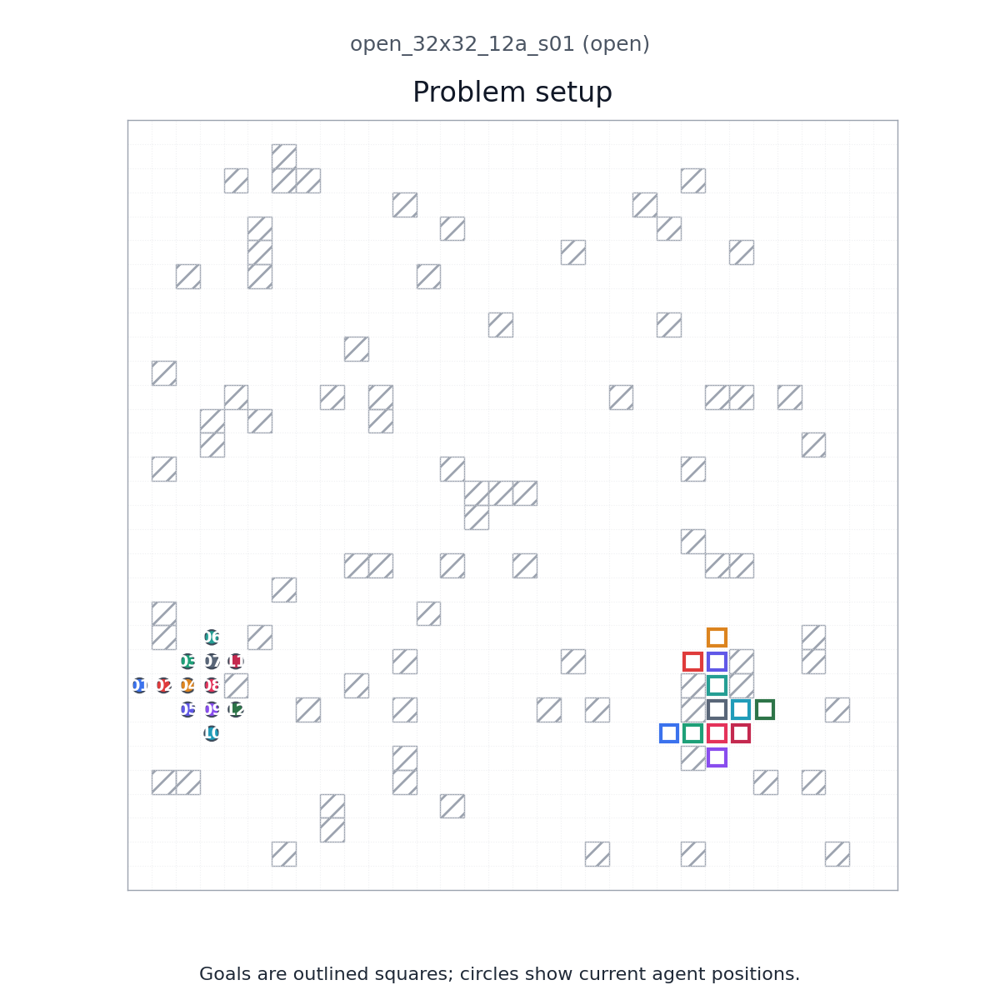
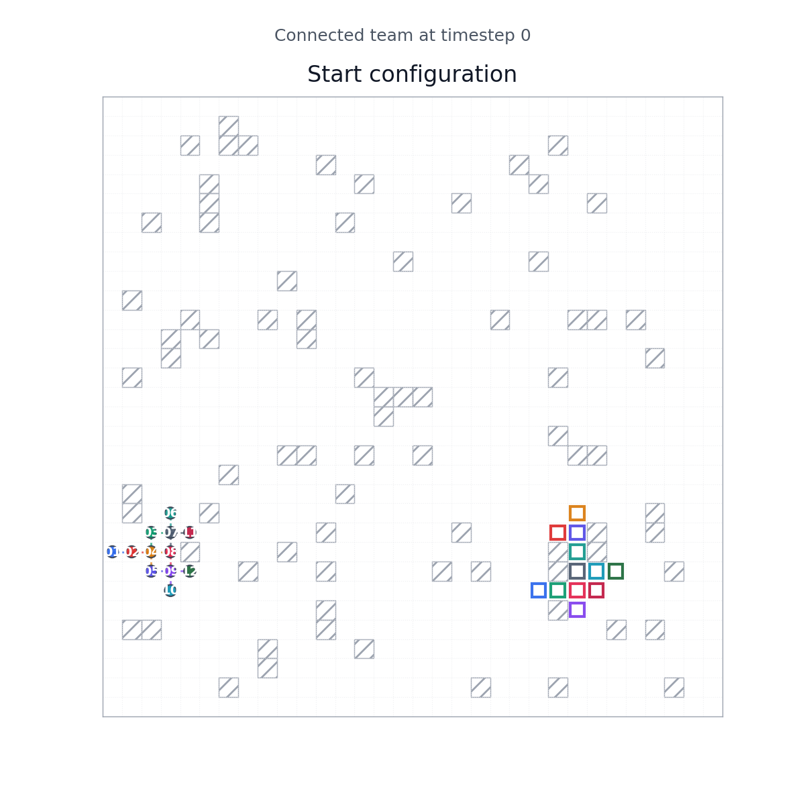
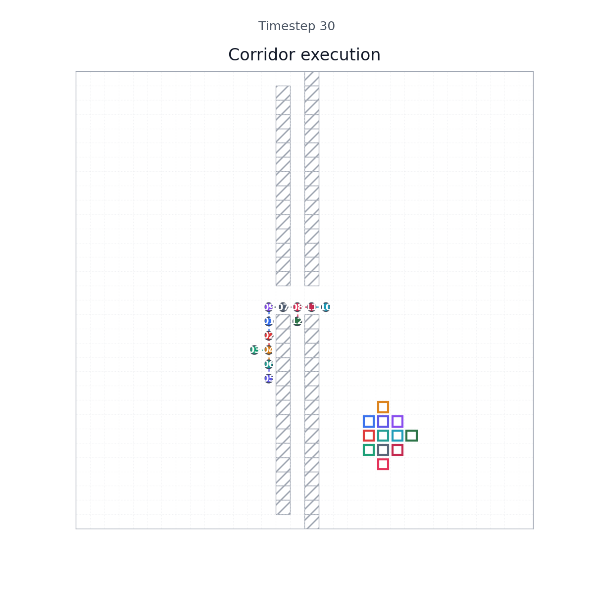
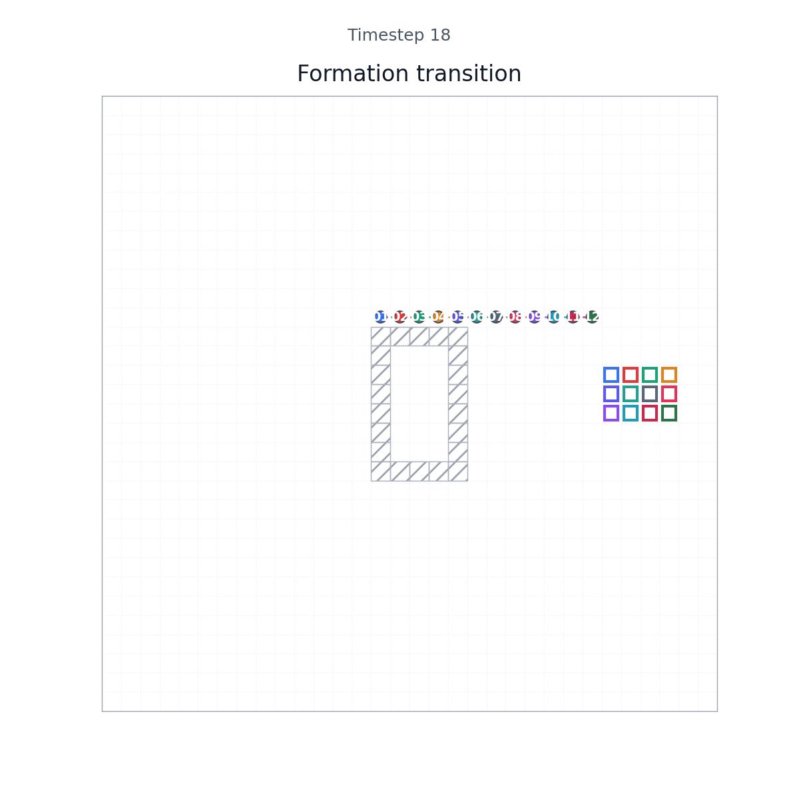
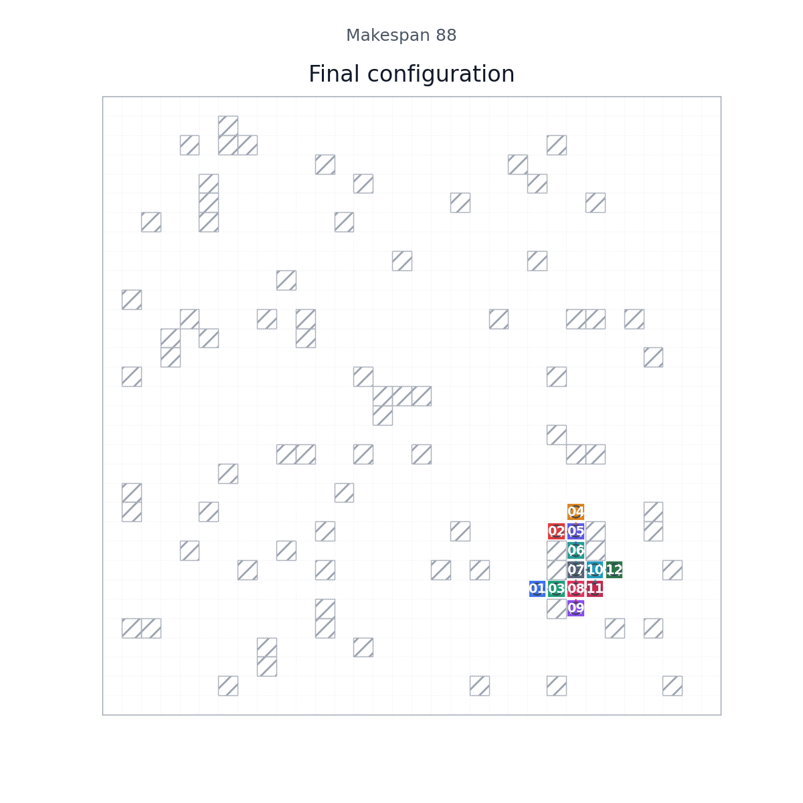
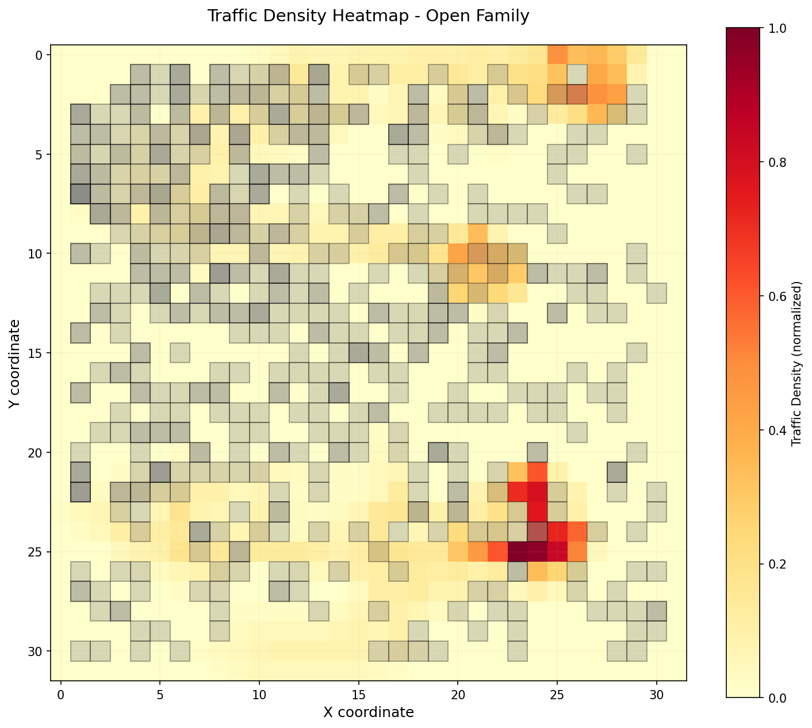
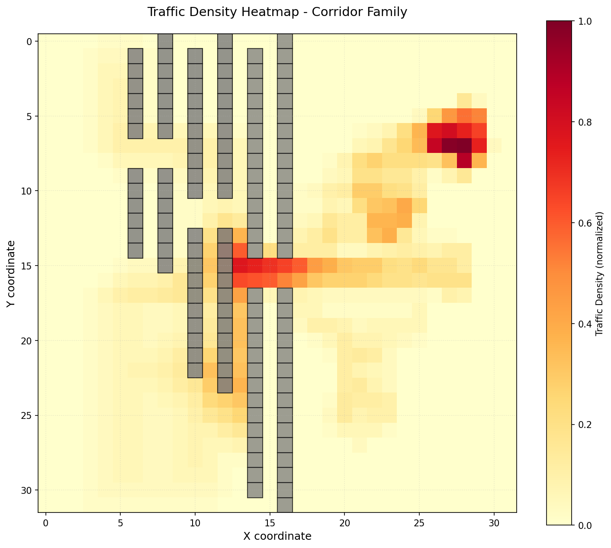
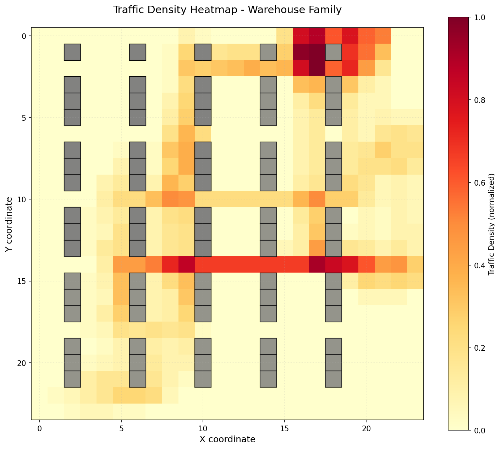
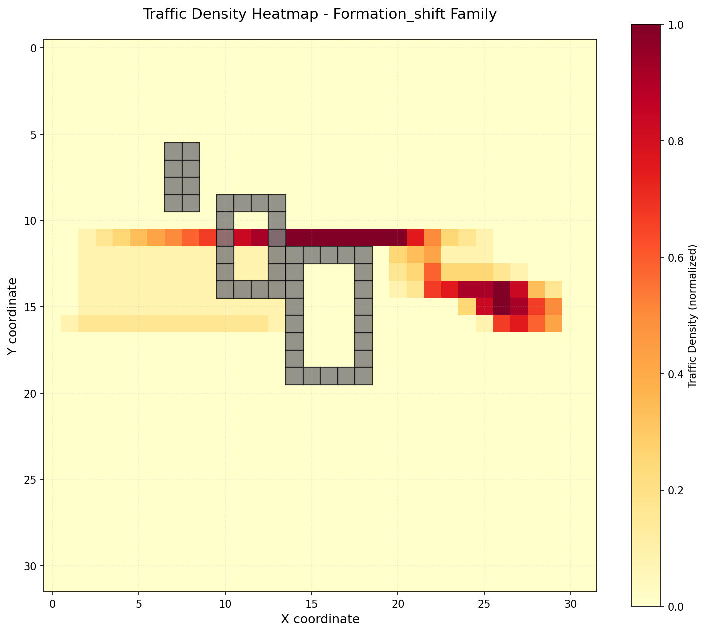
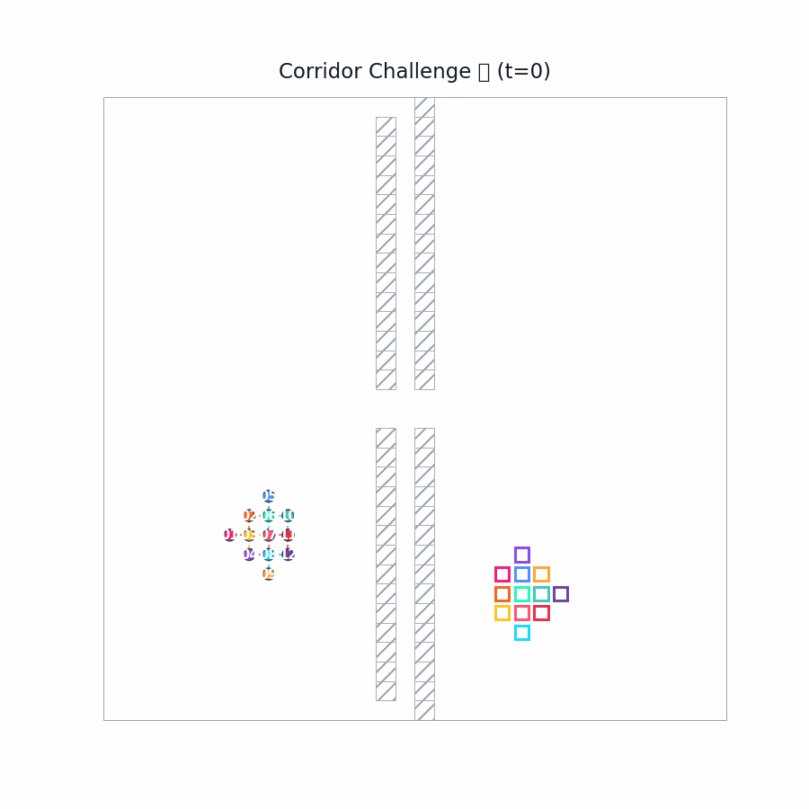

# CC-MAPF: Connectivity-Constrained Multi-Agent Path Finding

[](https://www.python.org/downloads/)
[](https://opensource.org/licenses/MIT)

This repository implements **Connectivity-Constrained Multi-Agent Path Finding (CC-MAPF)**, a variant of MAPF where agents must maintain communication connectivity while navigating to their goals.


*Example problem: 12 agents (colored circles) must navigate from start positions to goals while maintaining connectivity (edges between nearby agents).*

## Overview

Multi-Agent Path Finding (MAPF) solves the problem of routing multiple agents from start to goal positions without collisions. CC-MAPF adds a connectivity constraint: agents must remain within communication range of each other throughout execution.

**Key Features:**
- **Connectivity Constraint**: Agents maintain a connected communication graph
- **Collision-Free**: No vertex or edge collisions between agents
- **Multiple Scenarios**: Corridor, warehouse, formation shift, open space, and cluster shift
- **High Success Rate**: 86.7% (52/60) of test cases solved optimally

## Problem Visualization

### Initial Configuration

*Agents (colored circles) at their start positions with connectivity edges shown as gray lines.*

### Mid-Execution: Corridor Scenario

*Agents navigating a narrow corridor while maintaining connectivity constraints.*

### Formation Transition

*Agents transitioning from cluster to line formation while preserving communication links.*

### Final Configuration

*All agents successfully reached their goal positions with connectivity maintained throughout.*

## Performance Summary

| Scenario Type | Success Rate | Description |
|---------------|--------------|-------------|
| **Formation Shift** | 100% (5/5) | Agents reorganize into new formations |
| **Corridor** | 93.3% (14/15) | Navigation through narrow passages |
| **Open Space** | 86.7% (13/15) | Unconstrained movement with connectivity |
| **Warehouse** | 66.7% (10/15) | Navigation with obstacle-dense environments |
| **Overall** | **86.7%** | 52 of 60 instances solved |

## Traffic Analysis

Heat maps showing agent movement density across different scenarios:

### Open Space

*Low congestion with distributed movement patterns.*

### Corridor

*High density at corridor entry/exit points (bottleneck regions).*

### Warehouse

*Complex traffic patterns around obstacle clusters.*

### Formation Shift

*Coordinated movement with balanced traffic distribution.*

## Animated Demonstrations

### Scenario Comparisons

Side-by-side comparisons of baseline vs. connectivity-constrained solutions:

| Scenario | Animation | Description |
|----------|-----------|-------------|
| **Corridor** |  | Baseline (left) vs. Connected (right) navigation through narrow corridors |
| **Warehouse** |  | Comparison of path planning in obstacle-dense warehouse environments |
| **Formation** |  | Baseline vs. connected approaches to formation reconfiguration |

### Connected Solutions

Demonstrations of successful connectivity-constrained executions:

| Scenario | Animation | Description |
|----------|-----------|-------------|
| **Open Space** |  | 12 agents navigating open terrain while maintaining communication |

### Showcase Animations

High-quality animations of key scenarios:

| Scenario | Animation | Description |
|----------|-----------|-------------|
| **Corridor** |  | Full execution of corridor navigation with trail effects |
| **Formation** |  | Formation transition with motion trails |
| **Open Space** |  | Open field navigation with connectivity visualization |

## Installation

```bash
# Clone repository
git clone https://github.com/aimldlnlp/cc-mapf.git
cd cc-mapf

# Install dependencies
python3 -m pip install -e .

# Run benchmark suite
ccmapf batch --config configs/suites/benchmark_premium.yaml

# Generate visualizations
python render_advanced_visualizations.py artifacts/runs/{run_id} figures
```

## Usage

### Running a Single Instance

```bash
ccmapf solve --config configs/instances/small_team.yaml
```

### Batch Evaluation

```bash
ccmapf batch --config configs/suites/benchmark_premium.yaml
```

### Generate Visualizations

```bash
# Static visualizations (heatmaps, analysis)
python render_advanced_visualizations.py artifacts/runs/{run_id}

# Animated GIFs
python render_showcase.py artifacts/runs/{run_id}
```

## Project Structure

```
cc-mapf/
├── configs/              # Experiment configurations
│   ├── instances/        # Individual test instances
│   └── suites/           # Batch evaluation suites
├── src/cc_mapf/          # Core implementation
│   ├── model.py          # Data models (Agent, Instance, State)
│   ├── planners/         # Planning algorithms
│   ├── render.py         # Visualization engine
│   └── utils.py          # Utility functions
├── docs/assets/          # Documentation assets
│   ├── fig*.png          # Static figures
│   ├── heatmap_*.png     # Traffic analysis heatmaps
│   └── *.gif             # Animated demonstrations
├── tests/                # Unit tests
└── README.md             # This file
```

## Algorithm Details

The implementation uses **Connected-Step A/*** with the following features:
- **State Space**: Joint configurations with connectivity graph
- **Heuristic**: Sum of individual agent distances to goals
- **Connectivity Check**: Graph connectivity via DFS at each step
- **Collision Avoidance**: Vertex and edge constraint validation

## License

This project is licensed under the MIT License - see the repository for details.

## Acknowledgments

- Built with [matplotlib](https://matplotlib.org/) for visualization
- Academic theme inspired by Nature/Science publication standards
- Connectivity constraints based on multi-robot communication models
