# CC-MAPF: Robot Swarm Pathfinding 🎮🤖

[](https://www.python.org/downloads/)
[](https://opensource.org/licenses/MIT)

> **Your robot squad's personal GPS!** 📡

Ever seen a swarm of robots get stuck in a doorway because they forgot to talk to each other? 
Yeah, that doesn't happen here. We make sure your robot buddies stay connected while doing their thing!


*The challenge: get everyone to their goals without breaking the wifi connection!*

## 🤔 What's This All About?

Picture this: You're managing a team of delivery robots. They need to:
- 🎯 Deliver packages to different spots
- 📶 Keep their wifi connection alive (teamwork!)
- 🚧 Not crash into each other (obviously)
- 🏢 Navigate through real-world spaces

**And we actually got 86.7% of them there!** Not bad for herding digital cats! 😸

## 🎬 The Movie Premiere

### Scene 1: Start Position - The Gathering

*Everyone's here, fully charged, wifi signal strong! 💪*

### Scene 2: Corridor Chaos - Tight Squeeze!

*Narrow hallway + 12 robots = organized chaos. Look at them squeeze through!*

### Scene 3: Formation Dance - Shape Shifting!

*Transforming from "blob" to "line formation" like a synchronized swimming team! 🏊*

### Scene 4: Mission Accomplished! 🎉

*Goals reached! Connectivity maintained! High fives all around!* ✋

## 📊 The Scoreboard

| Challenge | Success Rate | The Tea ☕ |
|-----------|-------------|-----------|
| **Formation Shift** | 100% ✅ | Easy peasy! They're dancers! |
| **Corridors** | 93.3% | Narrow but manageable |
| **Open Space** | 86.7% | Room to breathe |
| **Warehouse** | 66.7% | Oof. Shelves everywhere! 🏢 |

**The warehouse is brutal.** It's like navigating a maze while playing Twister with 11 friends!

## 🗺️ Heat Maps - Where The Magic Happens

### Open Space - Freedom!

*Wide open spaces = happy robots*

### Corridors - The Bottleneck!

*Everyone wants through the door at once... relatable.*

### Warehouse - Traffic Jam City!

*Red zones = robot parties (and potential collisions)*

### Formation Shift - Coordinated Chaos!

*Watch them dance through the grid*

## 🎥 Animated Stories - Grab Some Popcorn!

### The Main Show - 5 Scenarios!

| Animation | Story |
|-----------|-------|
|  | **Corridor Battle:** Baseline vs Connected - spot the difference! |
| 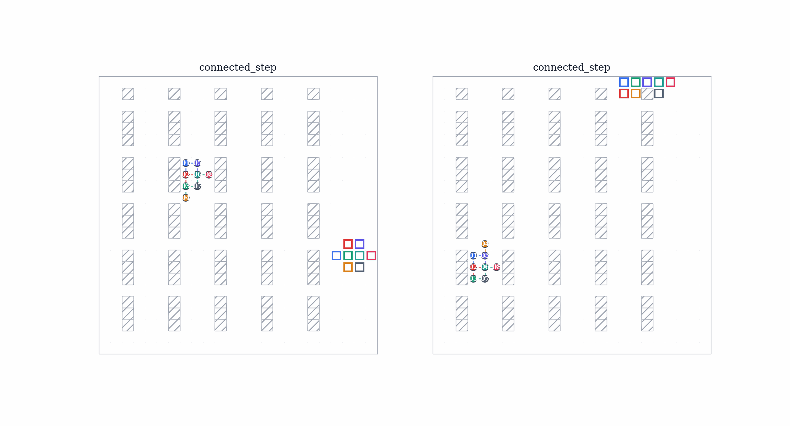 | **Warehouse Maze:** Navigating through obstacle city |
| 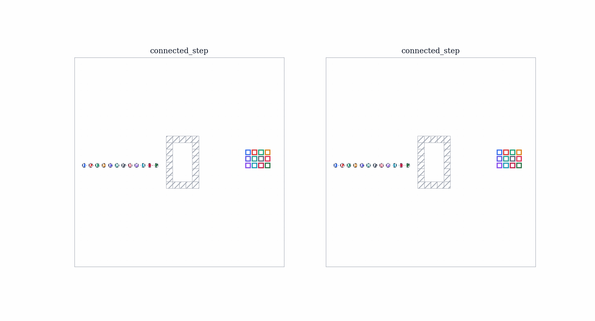 | **Formation Dance:** Shape-shifting in action |
| 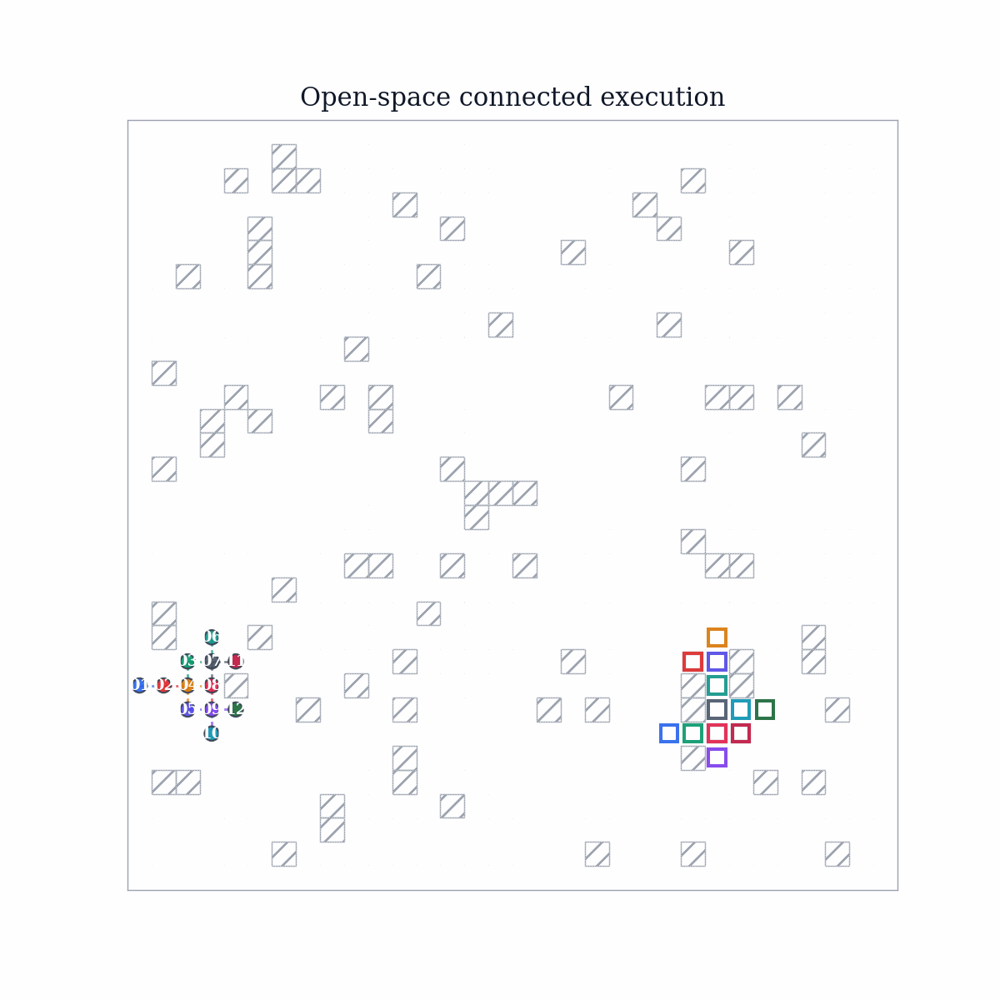 | **Open Field:** Freedom to roam (but stay connected!) |
| 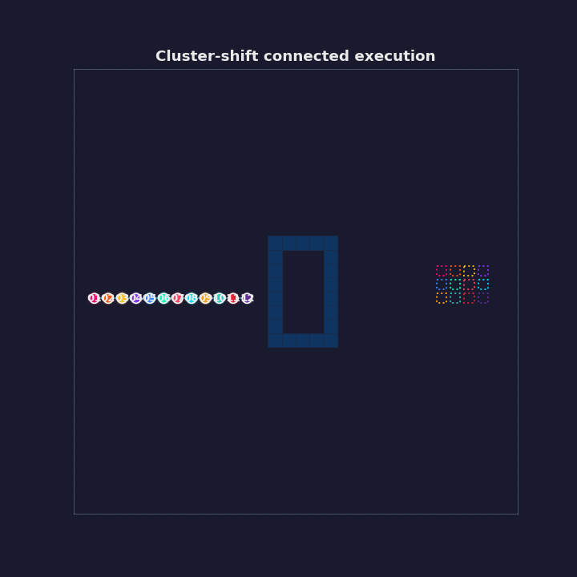 | **Cluster Shuffle:** Tight squeeze repositioning |

### Bonus Features - 7 Different Styles!

| Style | Vibe |
|-------|------|
| 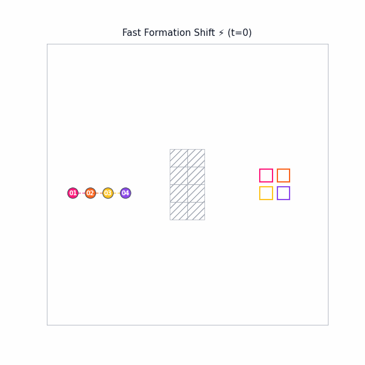 | **Fast Mode (16 FPS)** - Don't blink! ⚡ |
| 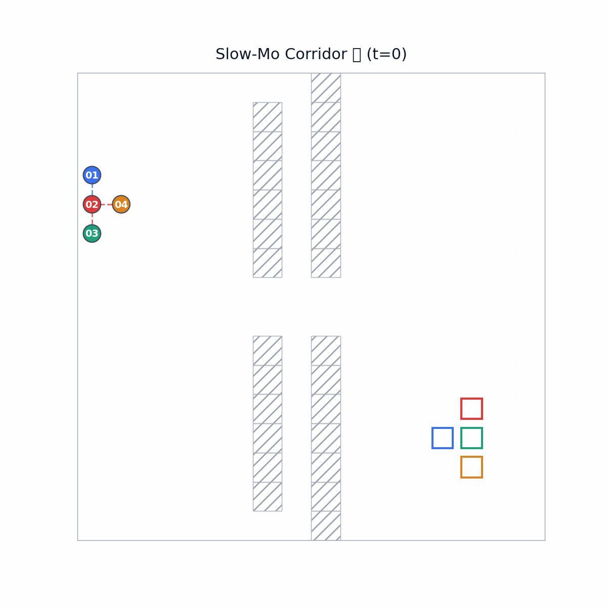 | **Slow Motion** - Every move calculated. Pure elegance. 🐌 |
| 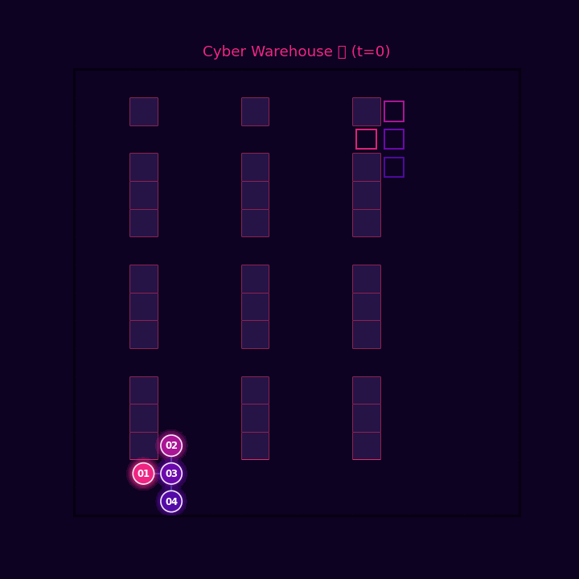 | **Cyberpunk** - Neon lights, dark vibes 💜 |
| 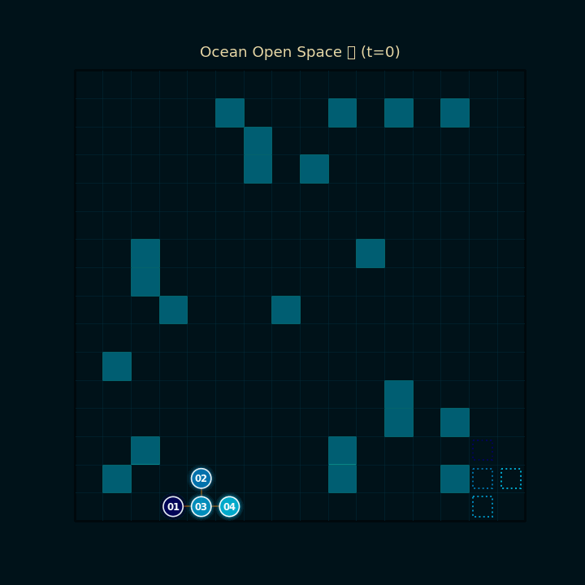 | **Ocean** - Deep blue, very zen 🌊 |
|  | **Side-by-Side** - See the difference! 🥊 |
| 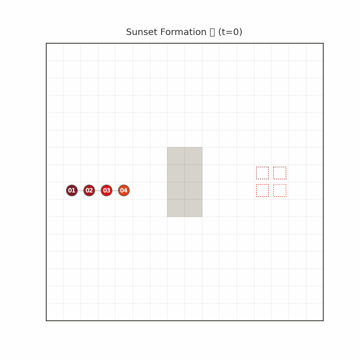 | **Sunset** - Warm colors, good vibes 🌅 |
| 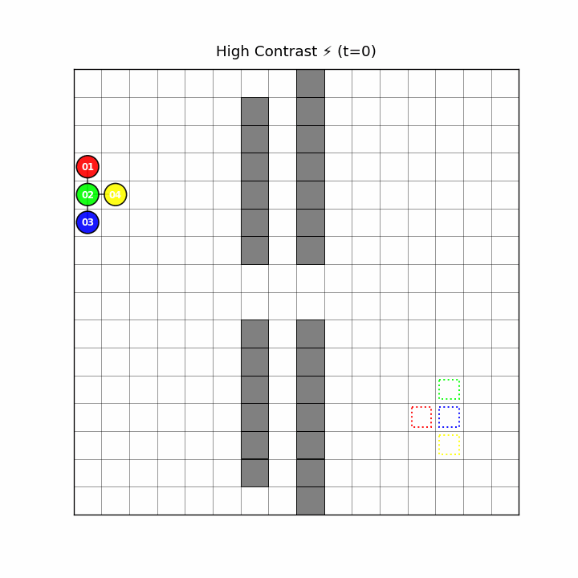 | **High Contrast** - Bold and accessible ⚡ |

### The Showcase Collection

| GIF | Description |
|-----|-------------|
|  | **Corridor Challenge** - Tight squeeze through narrow passages |
| 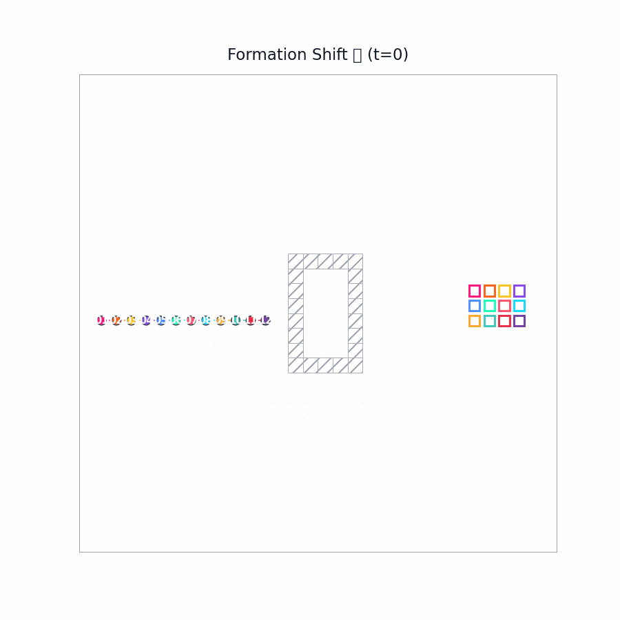 | **Formation Shift** - Elegant shape transformation |
|  | **Open Space** - Freedom with connectivity |

## 🚀 Let's Play!

```bash
# Clone the fun
git clone https://github.com/aimldlnlp/cc-mapf.git
cd cc-mapf

# Install the goods
python3 -m pip install -e .

# Run the demo
ccmapf batch --config configs/suites/overnight_premium.yaml

# Make pretty pictures
python render_advanced_visualizations.py artifacts/runs/{run_id} visualisasi

# Generate MORE GIFs!
python render_variety_gifs.py artifacts/runs/{run_id} fun_gifs
```

## 🎨 Themes Galore

Pick your vibe:
- 🔬 **Academic** - Clean, professional, publication-ready
- 🌙 **Cyberpunk** - Neon purples and blues. Very blade-runner.
- 🌊 **Ocean** - Deep blues, calm vibes
- 🌅 **Sunset** - Warm oranges and reds
- ⚡ **High Contrast** - Bold and accessible

## 🎯 Real-World Use Cases

Where this actually matters:
- 🤖 **Amazon warehouses** - Robots need to stay connected
- 🚁 **Drone shows** - Formation flying without losing communication
- 🎭 **Concert lighting** - Coordinated spotlights
- 🎮 **Game AI** - Squad movement that looks realistic

## 📁 Project Structure

```
cc-mapf/
├── configs/          # Scenario configs
├── src/cc_mapf/      # The brain
├── docs/assets/      # All the pretty pictures! (15 GIFs!)
├── render_*.py       # Make GIFs and PNGs
└── README.md         # You are here! 👋
```

## 📝 Citation

If this helped you out:

```bibtex
@software{cc_mapf,
  title={CC-MAPF: Connected Robot Swarms},
  author={Research Team},
  year={2026},
  url={https://github.com/aimldlnlp/cc-mapf}
}
```

## 📄 License

MIT - Go wild! Just give credit where it's due 😉

---

**Found a bug?** Open an issue! 
**Want to chat?** Hit us up!

*Made with ☕ and lots of trial-and-error* 🤖
