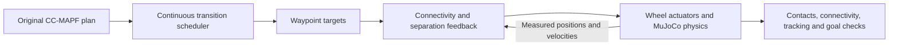

# Connectivity-Constrained Multi-Robot Navigation

**From discrete CC-MAPF plans to wheel-driven robot execution in MuJoCo.**

Four omnidirectional robots navigate shared spaces while preserving a connected
communication graph. The original CC-MAPF planner is extended with continuous
transition scheduling, measured-state feedback, native wheel physics and
reproducible execution checks.

https://github.com/user-attachments/assets/da7e61c0-6972-49b3-9986-2dba6f9e40e6

Demo: four robots, 16 × 16 warehouse, native wheel/roller contacts and a 1 m
Manhattan communication radius. Preview plays at **2× speed**.
[Full MP4](https://github.com/aimldlnlp/cc-mapf/releases/download/mujoco-demo-v1/warehouse-full.mp4) · [Reproduction guide](docs/DEMO.md).

## Engineering problem

A valid grid plan does not guarantee a valid physical execution. Interpolation
can break connectivity between checkpoints; tracking error can cause obstacle
contacts; retaining an old communication tree can oppose the next motion.
The execution layer measures these failures alongside final goal attainment.

## Architecture


```mermaid
flowchart LR
    A[Original CC-MAPF plan] --> B[Continuous transition scheduler]
    B --> C[Waypoint targets]
    C --> D[Connectivity and separation feedback]
    D --> E[Wheel actuators and MuJoCo physics]
    E -->|Measured positions and velocities| D
    E --> F[Contacts, connectivity, tracking and goal checks]
```

- **Scheduler:** preserves original joint checkpoints and inserts quarter steps
  or local half-cell detours when direct interpolation is invalid.
- **Four-robot feedback:** ranks a tree at predicted measured-state positions,
  accepts it only when every edge is currently within range, and otherwise uses
  the current-position tree. Radio and pair constraints modify desired velocity.
- **Physics:** three driven omni wheels and passive rollers per robot, bounded
  motor speed and torque, a 2 ms integration step and a chassis collision envelope.
- **Evidence:** frozen plans, input hashes, recorded perturbations, paired
  comparisons and a separate validation seed.

## Measured results

| Experiment | Robots / arena | Observed outcome |
|---|---|---|
| Saved regression | 4 / 16², 20², 24² cells | 48/48 safety and goal passes |
| New validation, seed 109 | 4 / 28² cells | 12/12 safety and goal passes |
| Experimental obstacle feedback | 6 / 20² cells | 3/3 executed nominal cases pass safety and goal checks |
| Six-robot formation | 6 / 20² cells | Scheduling timeout; no physical execution |

Four-robot paired regression reduces maximum checkpoint error from **589.9 to
152.4 mm** with identical plans, perturbations and physical durations. Maximum
error across all 2 ms samples is **175.7 mm**. New validation records at most
**152.5 mm** checkpoint error and **11.5 mm** final goal error. These 60 trials
include repeated conditions, not 60 independent maps.

Six-robot obstacle feedback eliminates contacts in the frozen open case but
worsens checkpoint error from **368.6 to 1105.0 mm**. It remains exploratory;
no six-robot disturbance sweep or independent validation is claimed.

[Protocol, trade-offs and per-run evidence](docs/RESULTS.md)

## Run the validated demo

Python 3.12 is the tested version. From a checkout of this branch:

```bash
python -m pip install -e ".[mujoco,dev]"
python scripts/demo_mujoco.py
```

The demo runs headless physics and checks safety, final goals and agreement with
the bundled reference. Render the same execution at 1080p / 30 fps:

```bash
python scripts/demo_mujoco.py --output artifacts/mujoco/demo-video --video artifacts/mujoco/demo-video/warehouse.mp4
python -m pytest -q
```

Rendering requires an OpenGL context. Physics and planning run on CPU; rendering
uses the available graphics device. The demo explicitly enables the validated
experimental tree selector; the base simulator retains its controller defaults.
Generated runs and MP4s stay outside version control. Curated inputs and small
evidence files are included.

## Scope and attribution

This simulation engineering extension builds on
[CC-MAPF](https://github.com/aimldlnlp/cc-mapf/tree/4e7419e584f6f1633624ffd440296a14d8da769e).
Reference plans use the original `connected_step` implementation at that pinned
commit. Its README reports 47/48 planning successes across 4/6/8/10 agents;
that metric differs from physical execution success here. Optional workspace
continuous-search extensions do not generate the reported reference plans.

One cell represents 1 m. Tests use radius-1 Manhattan adjacency and the bundled
robot. Passing sampled simulations does not establish formal safety, hardware
performance, real-time control or physical scaling to 8/10 robots. Bounded
feasibility projection provides neither optimality nor an infeasibility certificate.

Robot Soccer Kit assets come from MuJoCo Menagerie / Rhoban Team under MIT.
[Attribution](src/cc_mapf/assets/robot_soccer_kit/ATTRIBUTION.md) and
[asset license](src/cc_mapf/assets/robot_soccer_kit/LICENSE) accompany the meshes.
Project code: [MIT](LICENSE).
