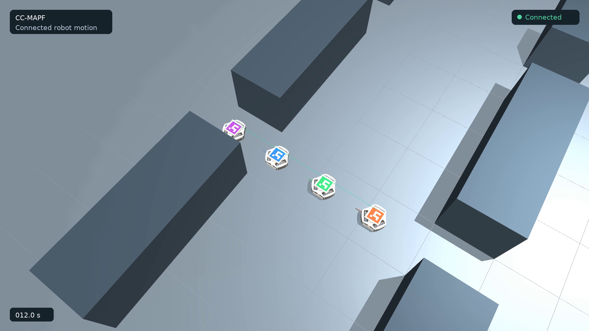

# Wheel-driven warehouse demo

The bundled demo executes the frozen `warehouse_16x16_4a_s03` plan with four
Robot Soccer Kit models. The 39.5 s physical execution uses native wheel and
roller contacts, 0.625 s quarter-waypoint timing, 250 ms motion prediction and
125 ms settling prediction. Colors identify robots and goals; permanent robot
labels are omitted from the presentation preset.

```bash
python scripts/demo_mujoco.py --output artifacts/mujoco/demo-video --video artifacts/mujoco/demo-video/warehouse.mp4
```

Presentation does not alter control or physics. The runner checks the result
against [the frozen reference](results/demo-reference.json).
[Input and source hashes](results/demo-manifest.json) identify the demo.

The short preview uses H.264 MP4 with YUV420 pixels and accelerated playback.
The full video preserves simulated time. Playback and downloads are available below.


https://github.com/user-attachments/assets/da7e61c0-6972-49b3-9986-2dba6f9e40e6



[Download full MP4](https://github.com/aimldlnlp/cc-mapf/releases/download/mujoco-demo-v1/warehouse-full.mp4)

[Download preview MP4](https://github.com/aimldlnlp/cc-mapf/releases/download/mujoco-demo-v1/warehouse-preview.mp4)
